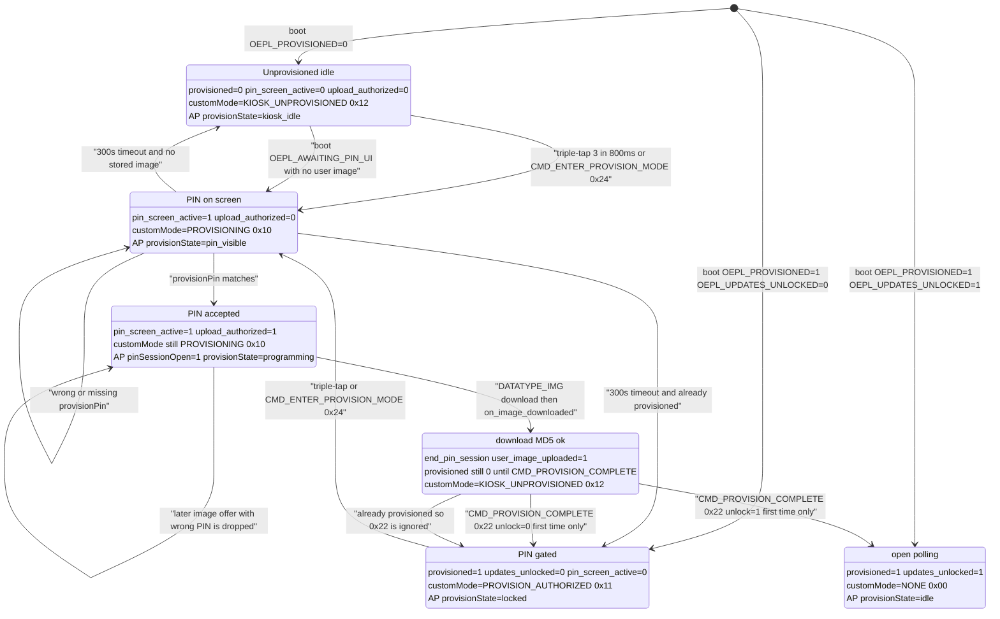

# defcon-34-eink-tags

## What this is

This is the repository for a fork of the Open E-Paper Link project. The major feature implemented here were the pin gated image provisioning feature and the AP-Portal image upload feature. The shipped fork is a lobotomized version of the firmware, locked down for operating a hostile Defcon environment.

## Hardware

The primary target of the firmware flashing are the Solum 2.6 BWRY Newton Pro EL026F6W4A tags. The "Spaghetti AP" option was used as the provisioning server, consisting of an ESP32-C6 for server and ESP32-S3 for the 802.15.4 communicating component, directions [here](https://github.com/OpenEPaperLink/OpenEPaperLink/wiki/Beginners-Guide-for-an-easy-to-build-Access-Point-%28aka-spaghetti-AP%29). 

## Firmware layout

Much of the engineering effort was focused on the tag side, with the AP side being a largely vibe coded segment (as evident by the miserable slider bars). The state machine logic lives between oepl_provision.c and oepl_app.c, with us entering into the provisioning state and rendering the data after the triple tap (oepl_provision.c:oepl_provision_on_button_press and oepl_button.c:oepl_button_notify_release). The logic which handles our state transitions exists within oepl_app.c:oepl_app_process.

There is no single C enum for kiosk mode. Tag behavior is the product of RAM/NVM flags in `oepl_provision.c`. Each poll advertises that mix as `AvailDataReq.customMode`, and the AP turns it into `provisionState` in `tag_db.cpp:fillNode`.

| Tag flags | `customMode` in poll | AP `provisionState` |
|-----------|---------------------|---------------------|
| `pin_screen_active=1`, `upload_authorized=0` | `TAG_CUSTOM_MODE_PROVISIONING` (0x10) | `pin_visible` |
| `pin_screen_active=1`, `upload_authorized=1` | still 0x10 | `programming` (`pinSessionOpen=1`) |
| `provisioned=0`, PIN screen off | `TAG_CUSTOM_MODE_KIOSK_UNPROVISIONED` (0x12) | `kiosk_idle` |
| `provisioned=1`, `updates_unlocked=0` | `TAG_CUSTOM_MODE_PROVISION_AUTHORIZED` (0x11) | `locked` |
| `provisioned=1`, `updates_unlocked=1` | `TAG_CUSTOM_MODE_NONE` (0x00) | `idle` |

`TAG_CUSTOM_MODE_PROVISION_AUTHORIZED` is the locked poll mode, not the in-RAM `upload_authorized` flag. Image offers are accepted only while `upload_authorized` is set (or `updates_unlocked` for a fully open tag). `CMD_PROVISION_COMPLETE` runs once: if `provisioned` is already 1, `oepl_app_process` drops it. A 1.5s button hold reboots and is not a kiosk state.
 

## Flash / build

A very crude PCBite setup was used to flash the tags twice over, yes twice over. The pinout on the back of these tags are well known and are well documented [here](https://github.com/OpenEPaperLink/OpenEPaperLink/wiki/Flashing-SiLabs-based-M3-Newton-Displays). Originally the flashing setup utilized a glasgow, but a jlink eventually was chosen to speed up the process of provisioning new firmware to the device.

## Development Notes

To be blunt, I've made extensive usage of LLMs during the development of this fork. This partially was an admitted experiment on my part to see how fast one could do such a project with the help of 2026 LLMs. One may be unsurprised to learn that during development it introduced a few vulnerabilities ranging from simple memory corruption to the more goofy architectual "broadcast tag pins constantly". My overall assessment is that it was great at setting up the development environment, and dealing with common build issues yet when it came time to coding it'd likely have been faster to do it myself. 

The tag has features which assume operation within a trusted network (presumably a home) and I removed these highly useful but risky features such as OTA and remote resets. A hostile environment such as Defcon required such countermeasures, but admittedly I took a risk with the AP having no encryption (vulnerable to mitm pineapple attacks during provisioning) but it fortunately worked out. My plan if someone set that up was to simply create a faraday cage, to isolate a user's device, the AP and the tag. Figuring out a secure OTA and more importantly implementing it would've taken longer than my allocated time. In your tag's current state, it doesn't do much other than poll for a nearby AP to asscociate with. The primary threat - defacement - is reasonably secured by the tag's state machine unless your attacker camps around with 802.15.4 stack vulnerabilties. 

## Limitations

Currently the tags are for certain vulnerable to active attacks by a wifi pineapple, additionally the only security checks done were a very rapid source code scan of near production firmware fork (it generated a few vulnerabilities within the tag firmware and AP as well). Of course the pins themselves are generated with a very simple RNG, being certainly not cryptographically secure nor even that long but "good enough". 

In terms of privacy, I would suggest covering up the side barcode on the tag (if you read those barcodes on the side, it is the tag's MAC) and removing the battery (as these eink tags poll constantly) should you have concerns of tracking. I have not recorded the MACs of the tags, and moreover I have no idea on who has which tags either; you'll just have to take my word for that one. 802.15.4 is still fairly obscure as a radio target however.

Lastly, this branch targets ONLY the Solum BRWY tags. The lot that was purchased also contained some freezer tags (black ink only) but these didn't quite function well for the purposes of giving out some fun eink tags to strangers to mess around with.

## License

Be excellent my dudes. 